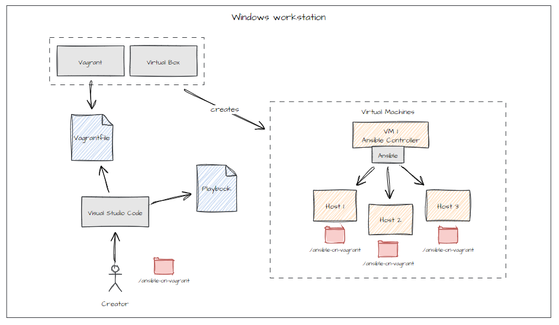

🤖 Ansible on Vagrant
=====================

This repo will demonstrate how to setup a small environment to **get you started** developing with **Ansible**.

We will create one ansible controller and 4 linux hosts. We are using **alpine** linux. Why? Because this is a very **small distro**. It has an iso 📀 of less than 100MB.

The hypervisor is VirtualBox. We use Vagrant from Hashicorp to interact and create virtual machines.



The diagram shows what the `Vagrantfile` contains.

Getting started
---------------
1. Download, install and start virtual box.
   Link: https://www.virtualbox.org/wiki/Downloads
2. Download and install vagrant.
   Link: https://developer.hashicorp.com/vagrant/install
3. Clone this git repo to some directory.
   `git clone https://github.com/saptube/ansible-on-vagrant.git`
3. Go into the cloned folder.
  `cd ansible-on-vagrant`
4. Build and start the virtual machines
  `vagrant up`

Take a look 👀. You now have 4 virtual machines 👊.

 **Youtube video**
 The steps above are also shown in the video:
 https://youtu.be/2sDxyLlqhCE

**log into the ansible_controller virtual machine**

You can use `vagrant ssh-config` to see the available keys and the ports to use.

In this example ssh on the controller is listening on port 2222. This port is shown during innition or you can request i with command `vagrant ssh`

Log into the ansible controller: `ssh vagrant@localhost -p 2222`. The default user is **vagrant** and this is the password as well.

**running the first playbook**

You are logged on to the **ansible_controller**. You can start the playbook.

We start the playbook from the `/vagrant` folder. This folder is "mounted"/"available" on each virtual machine.

```
# switch direcotry
cd /vagrant

# run playbook
ansible-playbook -i inventory.ini playbook.yml
```

License
---------
MIT

Copyright
---------

© 2025 SAL CONSULTANCY - saptube
